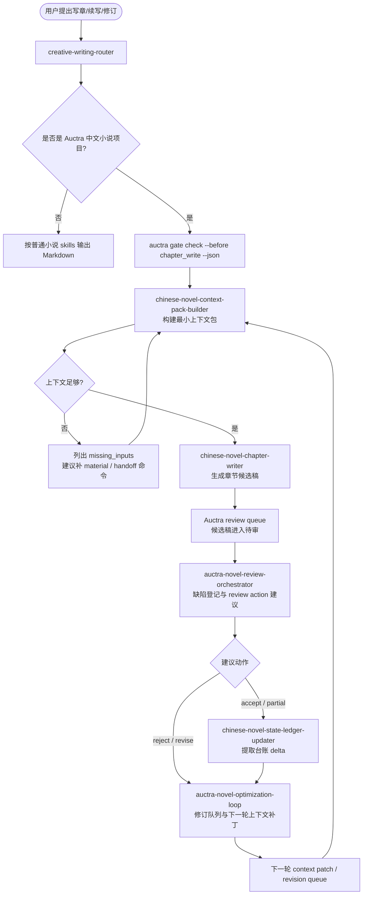
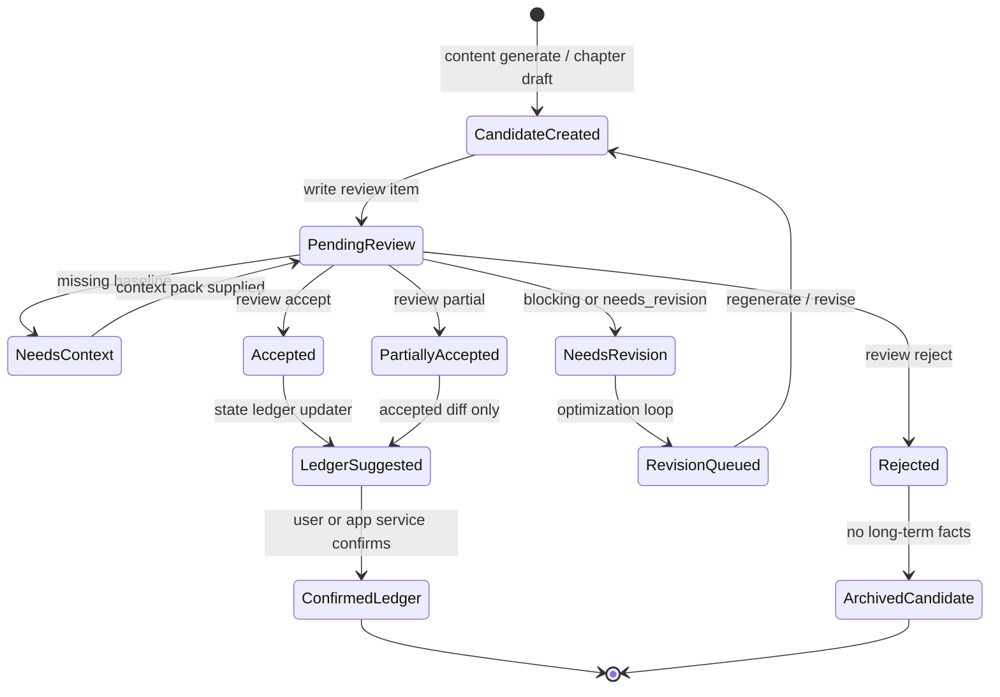
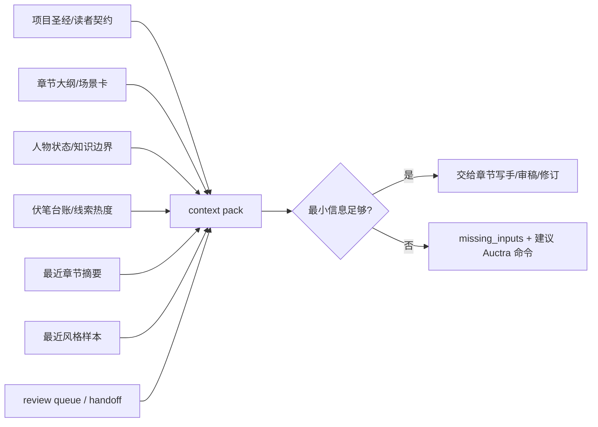
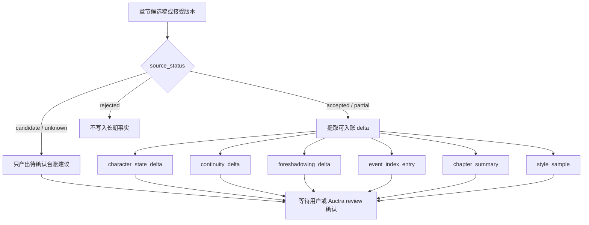
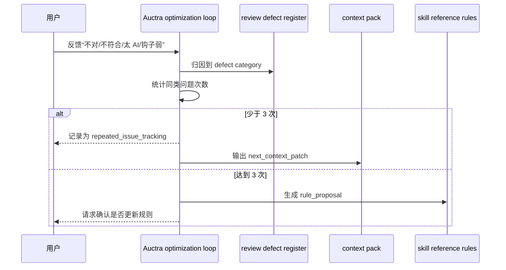
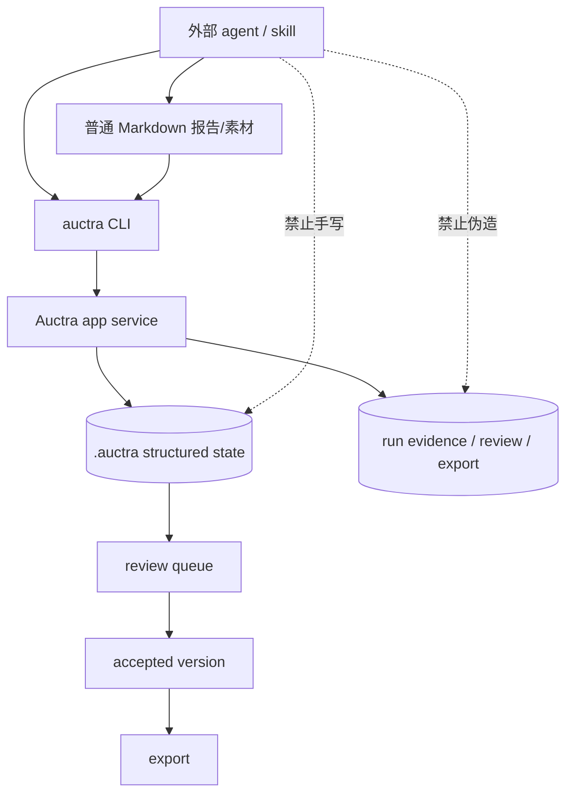

# Auctra 中文小说工作流 Mermaid 图

当需要解释 Auctra 与中文小说 skills 如何协作、如何从写前上下文进入候选稿、review、台账、优化闭环，或需要给用户/维护者展示流程时读取本文件。本文件只描述工作流和边界，不代表所有命令已经在 Auctra 中实现；命令能力缺口应在输出中单独标注。

## 端到端写章闭环

## Review 状态机

## 写前上下文包构建

## 写后台账建议

## 用户反馈与规则提案闭环

## Auctra 结构化资产边界

## 推荐使用方式

- 需要说明“为什么写章前先整理上下文”时，使用“写前上下文包构建”。
- 需要说明“候选稿为什么不能直接改长期台账”时，使用“写后台账建议”和“Review 状态机”。
- 需要设计或汇报 Auctra 小说优化能力时，使用“端到端写章闭环”和“用户反馈与规则提案闭环”。
- 需要强调 agent 不能手写 `.auctra/**` 时，使用“Auctra 结构化资产边界”。
