# 中文小说 Mermaid 图预设模板

## 使用时机

当中文小说任务需要把人物关系、时间发展、分卷推进、人物弧线、知识边界、空间路线、因果链、证据链、节奏热力或伏笔回收可视化时读取本文件。Mermaid 图只作为 Markdown reference 中的可复制预设，不代表必须渲染图片，也不需要新增 CLI 命令。图中的节点名称要短，复杂说明放在图后面的备注里；不要把完整项目圣经硬塞进一张图。

## 设计原则

- 一张图只回答一个结构问题：谁影响谁、事件如何推进、读者知道什么、伏笔在哪里兑现。
- 节点用短标签，细节放图后备注；长篇项目可按卷、角色组、地点或线索拆成多张图。
- 关系标签写叙事功能，不只写身份：亏欠、误解、保护、利用、试探、隐瞒、背叛风险、共同秘密。
- 时间图必须标出章节或卷次，避免只有抽象阶段；涉及悬疑、权谋、穿越、回忆时必须标知识边界。
- 图可作为写前规划、修订诊断或导出检查，不应替代正文、章节卡、项目圣经和连续性台账。

## 图结构选择矩阵

| 需求 | 推荐图型 | 最小信息 | 适合阶段 |
| --- | --- | --- | --- |
| 看清角色关系和冲突 | `graph TD` / `flowchart LR` | 角色、关系功能、秘密或代价 | 人物设计、修订 |
| 梳理多线时间 | `timeline` / `gantt` / `gitGraph` | 章节、事件、状态变化、payoff | 大纲、连续性 |
| 检查人物成长 | `stateDiagram-v2` / `journey` | 旧信念、压力、选择、代价 | 人物弧线、章末修订 |
| 防止上帝视角泄漏 | `sequenceDiagram` | 读者、主角、配角、反派知道的信息 | 悬疑、权谋、连续性 |
| 展示空间移动 | `flowchart TB` | 地点、移动原因、阻力、资源变化 | 旅程、冒险、逃亡 |
| 追踪伏笔回收 | `flowchart TD` | seed、误导、升级、payoff、新债务 | 修订、导出前 |
| 检查读者承诺 | `requirementDiagram` | 承诺、验收、章节证据 | 开篇、卷末、导出前 |
| 管理世界规则 | `mindmap` / `flowchart TD` | 规则、限制、例外、代价 | 世界观、设定解释 |

## 人物关系图

用于设计主角团、反派阵营、家族/组织、情感关系、亏欠和背叛风险。关系标签要写冲突功能，不只写“认识”。

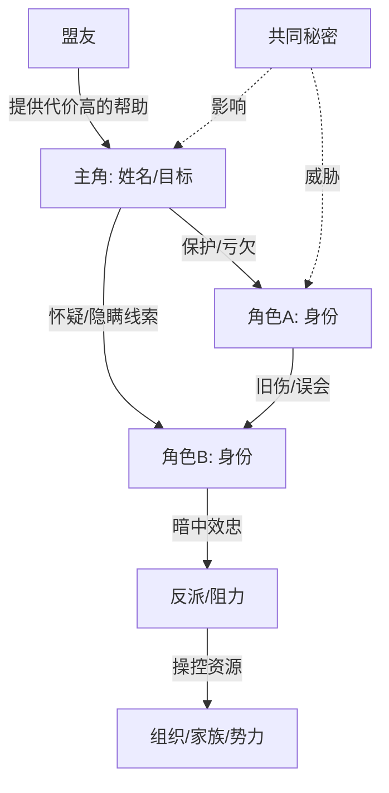

### 阵营与权力网

用于权谋、都市商战、仙门宗派、家族争产和组织斗争。用 `subgraph` 把阵营分开，箭头写资源、控制、依附和背叛条件。

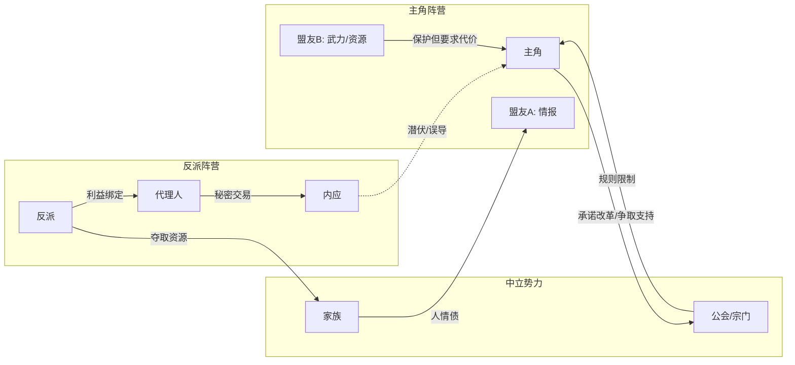

### 情感张力图

用于感情线、搭档线、师徒线和宿敌线。箭头不要只写“喜欢”，要写吸引点、阻碍、误会和关系阶段。

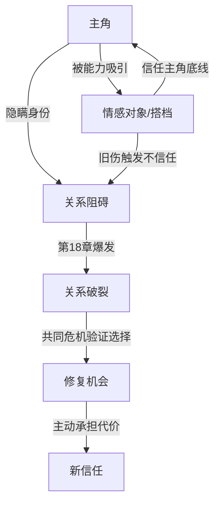

### 人物关系填空

```markdown
- 图目标：展示主角团 / 反派阵营 / 情感线 / 家族线 / 权力网
- 关键关系：保护、亏欠、利用、试探、隐瞒、误会、吸引、背叛风险
- 必须可见的冲突：
- 哪些节点属于正典：
- 哪些关系仍是暂定：
- 下一次关系变化发生在第几章/第几卷：
```

## 时间发展图

用于整理主线时间、章节时间、回忆/插叙、案件时间、旅程、训练和伏笔埋设/回收。适合连续性编辑和分卷规划。

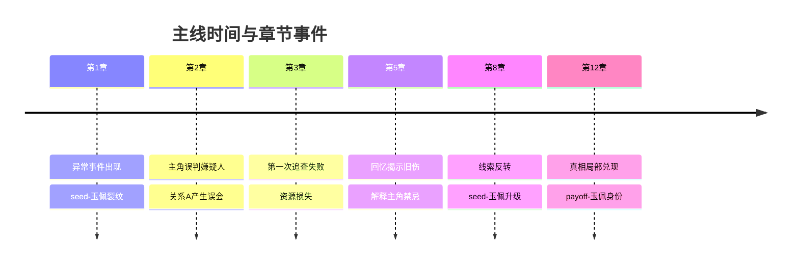

### 多线并行时间图

用于主线、感情线、反派行动、案件真相同时推进的长篇。`gantt` 适合检查时间重叠、恢复期、旅途距离和闭关训练时长。

```mermaid
gantt
  title 多线并行时间检查
  dateFormat  X
  axisFormat  第%L章
  section 主线调查
  异常出现           :active, main1, 1, 2
  第一次追查失败     :main2, after main1, 2
  局部真相兑现       :milestone, main3, 12, 0
  section 感情/搭档线
  误判与试探         :rel1, 2, 4
  信任破裂           :crit, rel2, 7, 2
  共同承担代价       :rel3, 10, 3
  section 反派暗线
  投放误导线索       :vill1, 1, 5
  切断证人           :crit, vill2, 6, 2
  转移核心资源       :vill3, 9, 4
```

### 多线分支图

用于穿越、重生、平行叙事、梦境回收或多 POV 分线。`gitGraph` 的分支不是代码分支，而是叙事线分叉和汇合。

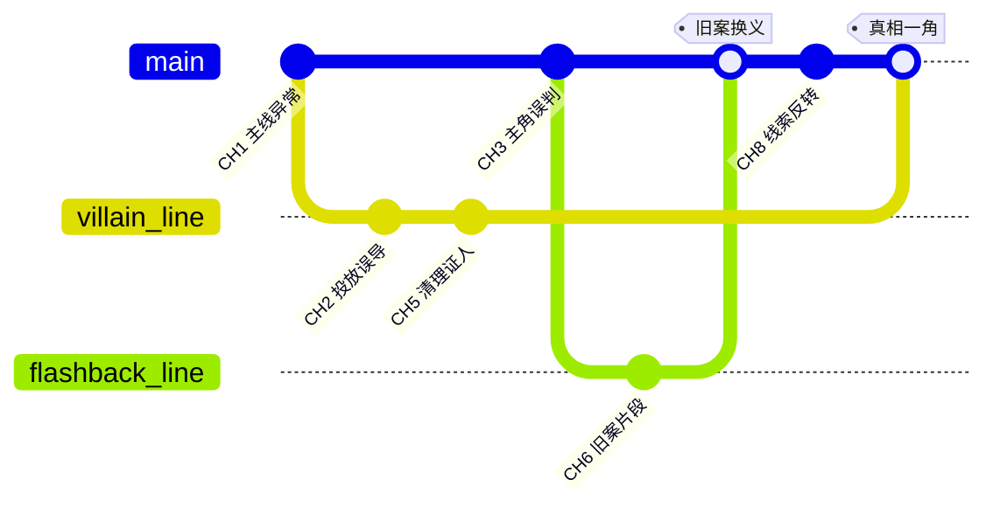

### 时间发展填空

```markdown
- 时间轴类型：主线 / 案件 / 感情 / 修炼 / 旅程 / 分卷 / 反派暗线
- 时间单位：章节 / 日期 / 卷 / 幕
- 必须标注：seed、误导、状态变化、payoff、deferred
- 连续性风险：时间跳跃、伤病恢复、角色知识提前、旅途距离、闭关时长
- 哪些事件是读者先知道：
- 哪些事件是角色后知道：
```

## 空间路线图

用于冒险、逃亡、旅行、探案、仙侠秘境、星际航线和校园/城市多地点调度。节点写地点功能，边写移动阻力和代价。

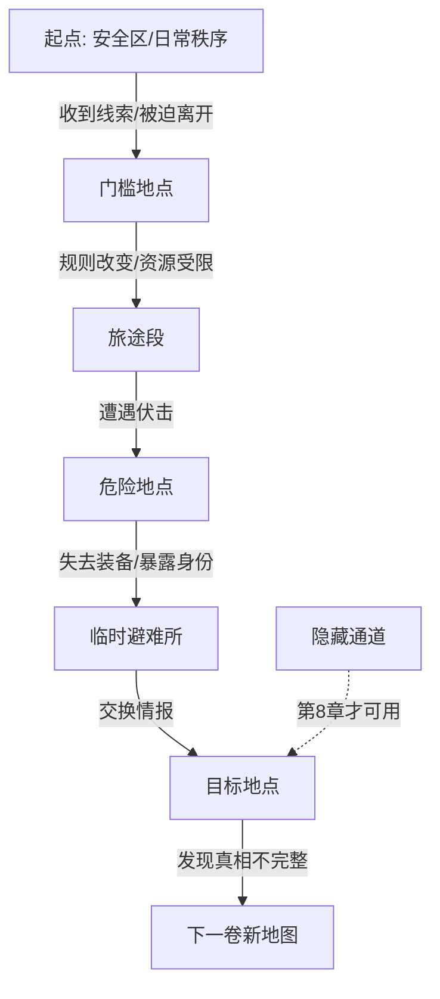

### 空间路线填空

```markdown
- 地图范围：城市 / 学院 / 宗门 / 秘境 / 星际 / 旅途
- 每个地点的叙事功能：安全、诱惑、危险、补给、真相、选择
- 移动代价：时间、金钱、伤势、通行证、关系、人情债
- 不可跨越限制：规则、距离、身份、天气、追兵、封锁
- 需要回访的地点：
```

## 分卷推进图

用于规划长篇的每卷目标、升级路径、低谷、高潮和下一卷引线。适合 `chinese-novel-volume-arc-planner`。


### 分卷推进填空

```markdown
- 全书核心问题：
- 每卷阶段问题：
- 每卷读者回报：爽点 / 情绪 / 真相 / 关系 / 世界规则
- 每卷代价：身体 / 关系 / 资源 / 秘密 / 声望 / 时间
- 下一卷引线：
```

## 人物弧线图

用于展示人物从旧信念到新选择的变化。`stateDiagram-v2` 适合状态转移；`journey` 适合情绪体验和章节节奏。

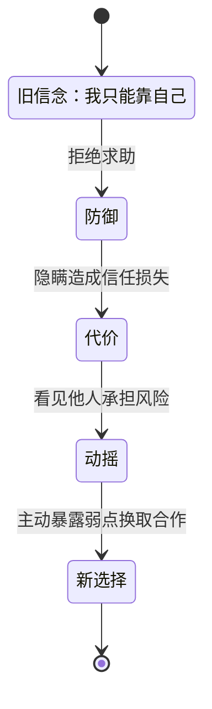

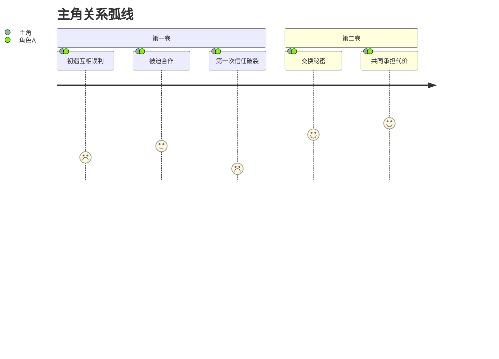

### 人物弧线填空

```markdown
- 角色：
- 旧信念：
- 缺陷如何制造问题：
- 三个压力节点：
- 改变的可见行动：
- 改变代价：
```

## 知识边界图

用于检查角色在不同章节知道什么、误解什么、隐瞒什么，防止上帝视角泄漏。适合连续性编辑、悬疑和权谋线。

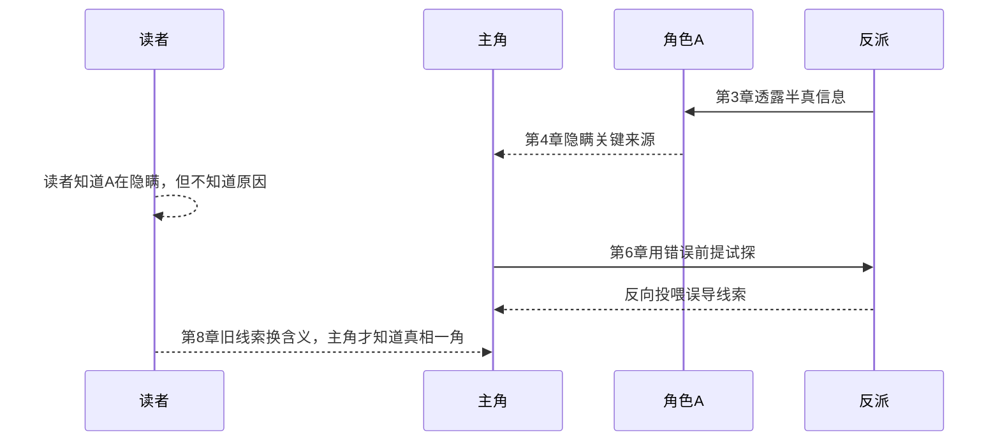

### 视角切换图

用于多 POV、群像、双线叙事和反派视角。重点检查每章视角是否带来新信息，而不是重复同一事件。

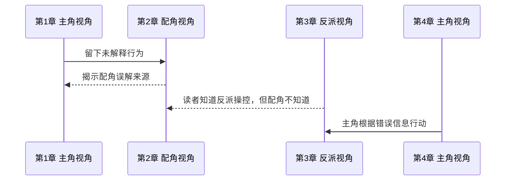

### 知识边界填空

```markdown
- 信息项：
- 读者知道时间：
- 主角知道时间：
- 配角知道时间：
- 谁在隐瞒：
- 谁在误解：
- 最早可公开章节：
```

## 因果链图

用于检查剧情推进是否由角色选择导致，而不是靠巧合堆事件。适合修订章节中段、高潮前和卷末回看。

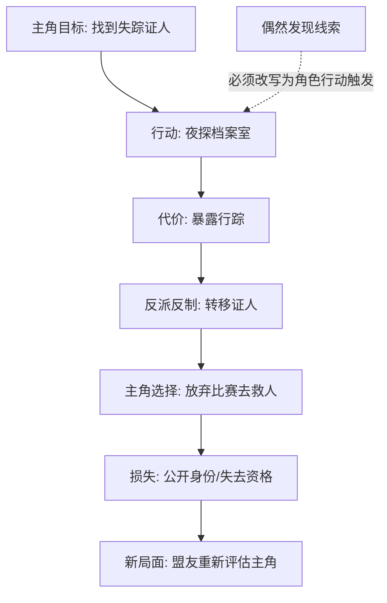

### 因果链填空

```markdown
- 本段剧情的主动选择：
- 选择之前的压力：
- 选择导致的直接后果：
- 后果带来的新选择：
- 需要删除或改写的巧合：
```

## 证据链图

用于悬疑、探案、权谋、复仇和身份谜题。把证据、误导、证人、假结论和真结论拆开，避免真相过早显形。

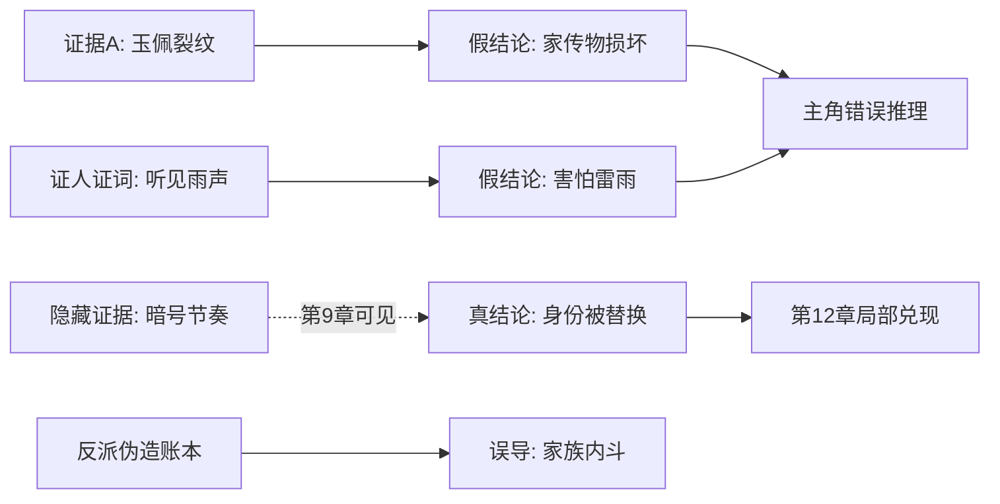

### 证据链填空

```markdown
- 真相：
- 可公开证据：
- 误导证据：
- 谁提供证据：
- 主角的错误结论：
- 读者能提前猜到但不能确认的点：
```

## 世界规则依赖图

用于仙侠、玄幻、科幻、系统文、无限流和规则怪谈。只画会影响剧情选择的规则，不画百科条目。

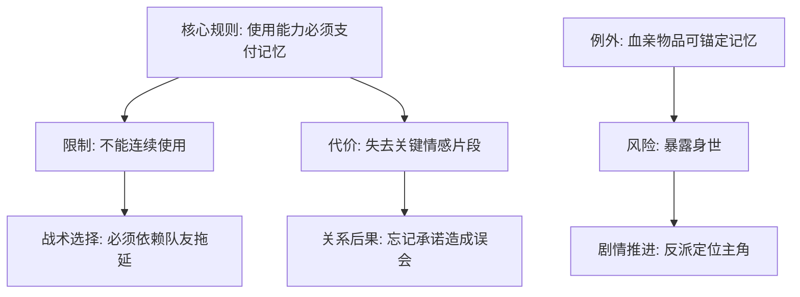

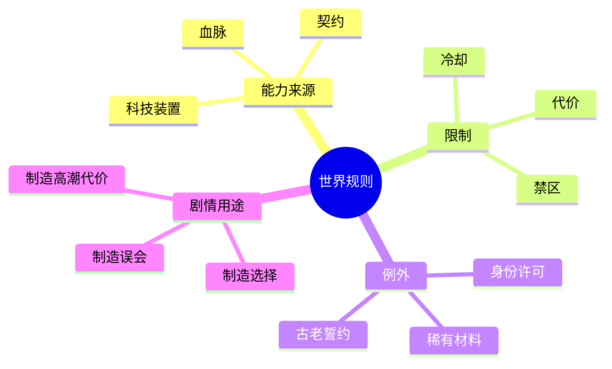

### 世界规则填空

```markdown
- 核心规则：
- 限制：
- 例外：
- 代价：
- 谁知道规则：
- 第一次展示章节：
- 第一次利用规则反转章节：
```

## 节奏热力图

用于检查章节是否连续低压、连续解释、连续无回报，或高潮前缺少蓄力。`quadrantChart` 适合粗略定位章节状态。

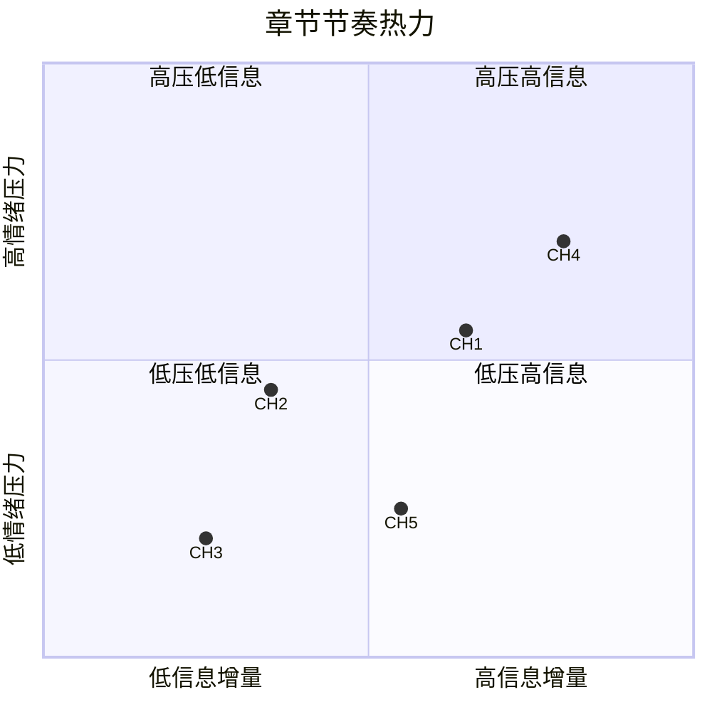

### 节奏热力填空

```markdown
- 连续低压章节：
- 连续解释章节：
- 缺少读者回报的章节：
- 需要提前的冲突：
- 需要延后的信息：
```

## 读者承诺履约图

用于检查开篇承诺、类型承诺、卷承诺和人设承诺是否有证据支撑。适合导出前和大纲评审。

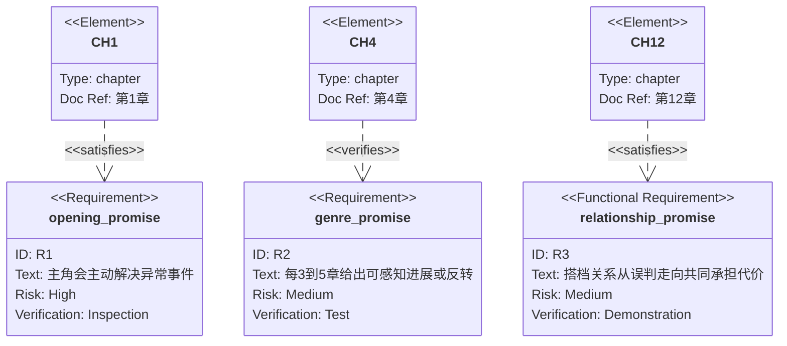

### 读者承诺填空

```markdown
- 开篇承诺：
- 类型承诺：
- 人设承诺：
- 最近一次履约章节：
- 下一次必须履约章节：
- 已经违约或弱化的承诺：
```

## 伏笔回收图

用于把 seed、误导、升级、payoff 和新债务串起来。适合导出前检查、卷末高潮和连续性台账。

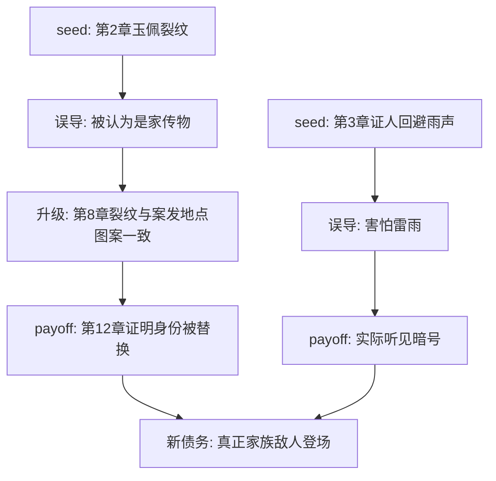

### 伏笔回收填空

```markdown
- seed：
- 表层解释：
- 误导：
- 升级节点：
- payoff：
- 回收后的局面变化：
- 新债务或下一卷引线：
```

## 组合方案

### 长篇开书设计包

```markdown
1. 人物关系图：主角、核心搭档、反派、组织和秘密。
2. 时间发展图：前12章主线推进和第一次兑现。
3. 世界规则依赖图：只列前三章必须理解的规则和代价。
4. 读者承诺履约图：开篇承诺、类型承诺、人设承诺。
```

### 卷末修订包

```markdown
1. 分卷推进图：本卷阶段问题、卷末高潮、下一卷引线。
2. 因果链图：高潮是否由角色选择触发。
3. 伏笔回收图：seed、误导、payoff、新债务是否完整。
4. 节奏热力图：高潮前是否有蓄力，余波是否有新问题。
```

### 悬疑连续性包

```markdown
1. 证据链图：真证据、假证据、假结论和真结论。
2. 知识边界图：读者、主角、嫌疑人、反派分别知道什么。
3. 时间发展图：案发、伪装、调查、回收的准确顺序。
4. 人物关系图：动机、利益、旧怨和共同秘密。
```

### 群像权谋包

```markdown
1. 阵营与权力网：资源、控制、依附和背叛条件。
2. 多线分支图：主角线、反派线、中立势力线如何汇合。
3. 视角切换图：每个 POV 是否提供新增信息。
4. 读者承诺履约图：权谋类型承诺是否持续兑现。
```

## 输出规范

- 先给图，再给 3 到 7 条图后备注；备注说明临时设定、连续性风险和下一步写作动作。
- 如果图超过 12 个节点，拆成主图和子图；主图只保留高层结构，子图处理局部复杂关系。
- Mermaid 节点 ID、branch、checkout、merge、requirement、element、quadrantChart 点名等机器标识使用 ASCII；中文放在标签、`text`、`docref` 或图后备注里。
- Mermaid 节点名称避免长句、引号、括号嵌套和特殊符号；复杂中文说明放到备注。
- 修改既有图时保留节点 ID 的稳定性，方便后续 diff 和人工比对。
- 不确定的信息用虚线或备注标明“暂定”，不要伪装成正典。

## 使用检查表

- 图是否回答一个明确问题，而不是展示所有信息。
- 节点名称是否短到可读，细节是否移到图后备注。
- Mermaid 语法是否使用常见块：`graph TD`、`timeline`、`flowchart LR`、`flowchart TB`、`stateDiagram-v2`、`journey`、`sequenceDiagram`、`gantt`、`gitGraph`、`mindmap`、`quadrantChart`、`requirementDiagram`。
- `gitGraph` 分支名、`requirementDiagram` 对象名和 `quadrantChart` 点名是否为 ASCII，避免中文标识符导致解析失败。
- 人物图是否标出关系功能和冲突，不只标身份。
- 时间图是否标出章节、seed、payoff 和 deferred 风险。
- 知识边界图是否避免让角色提前知道不该知道的信息。
- 因果链是否主要由角色选择推进，而不是靠巧合移动剧情。
- 证据链是否同时保留误导和可回看的真相证据。
- 世界规则是否有代价、限制和剧情用途，而不是设定百科。
- 节奏热力是否指出需要压缩、提前或延后的章节。
