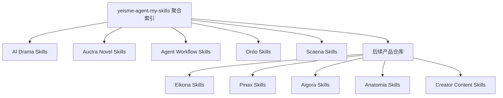

# Skills 仓库拆分路线图

## 目标

把“按文件夹堆放的 Skill 集合”演进为“按产品 Owner 独立发布、由聚合仓库统一发现”的矩阵。拆分只改变源码归属和发布边界，不改变稳定 Skill 名称、触发描述、profile 引用或 canonical Owner。



## 已完成拆分

| 项目 | 状态 | 原则 |
| --- | --- | --- |
| AI Drama | 已独立 | 做剧矩阵拥有自己的 Router、格式/类型、编剧、导演、连续性、评审和生产交接 |
| Auctra Novel | 已独立 | 小说矩阵与 Auctra runtime 一起维护，避免和通用内容写作混合 |
| Agent Workflow | 已独立 | 只保留通用 runtime、仓库路由和 Skill 治理，不再夹带 Ordo/Scaena 产品技能 |
| Ordo | 已独立 | DAG、worktree lease 和 runtime canary 由 Ordo Owner 维护 |
| Scaena | 已独立 | 生产、主体资产就绪和视频转绘由 Scaena Owner 维护 |

## 下一批建议

| 优先级 | 新仓库 | 来源 | 处理方式 |
| --- | --- | --- | --- |
| P1 | `eikona-skills` | `eikona-image/` + `cli-runtime/yeisme-eikona-cli-runtime` | 让图像生成、资产生命周期、视觉路由和 Eikona runtime 同仓；Skill 名称不变 |
| P1 | `pinax-skills` | `pinax-agent/` + `cli-runtime/yeisme-pinax-cli-runtime` | 让 Pinax Router、操作矩阵和 runtime 同仓；保持本地优先边界 |
| P1 | `aigora-skills` | `architecture/` | 将 Seedance/Aigora 架构合同交给 Aigora Owner；若仍处设计期可先保持聚合模块 |
| P1 | `anatomia-skills` | `video-analysis/` | 视频分析、分镜审阅、学习闭环和资产交接独立演进 |
| P2 | `creator-content-skills` | `content-writing/` + `social-content/` + `scriptwriting/` | 合并通用创作者内容，不吸收 Auctra Novel 或 AI Drama 的 canonical 工作流 |
| P2 | `creative-writing-core-skills` | `creative-writing-core/` | 只保留跨小说、短剧和内容创作的 Router、Style Lens 与按需安装协议 |
| P2 | `frontend-workflow-skills` | `frontend-design/` | UI/TUI、动效、质量和视觉回归作为通用前端工作流独立发布 |
| P3 | `llm-game-skills` | `game-development/` | 在场景矩阵获得外部使用证据后独立发布 |
| P3 | `sonora-skills` | `audio-workflow/` | 当 Sonora 增加第二个以上稳定 Skill 或独立发布节奏后拆出 |

## `cli-runtime/` 的清理原则

`cli-runtime/` 不是长期项目边界。它同时包含 Ordo、Connectors、Eikona、Pinax、Quaestor 和 Git worktree 流程，后续应按 Owner 移动：

- Eikona runtime → `eikona-skills`；
- Pinax runtime → `pinax-skills`；
- Ordo、Connectors、Quaestor runtime → 对应产品 Skills 仓库；
- 通用 Git worktree workflow → `agent-workflow-skills`；
- 迁移期间保留原 Skill 名称，并在聚合仓库中使用 submodule 指针升级，不建立重复副本。

## 暂留聚合仓库

`engineering/`、`project-development/`、`qa-release/`、`knowledge/`、`web-research/` 和 `mcp/` 目前属于跨项目治理或单一共享能力，暂留聚合仓库。满足以下任一条件再拆：

1. 有清晰的独立 Owner 和发布节奏；
2. 需要单独版本、release 或安装入口；
3. 与聚合仓库的变更频率、权限或依赖明显不同；
4. 至少有两个外部消费者需要独立安装；
5. 当前模块开始承载产品状态或专属 contract。

## 兼容迁移

1. 先在独立仓库发布可验证版本。
2. 聚合仓库删除原目录并在同路径或新 Owner 路径挂载 submodule。
3. Skill `name` 和 `agents/openai.yaml` 契约保持不变。
4. 宿主 resolver 必须递归遍历已初始化 submodule。
5. 一个迁移窗口内禁止同时保留旧副本与新 submodule，避免重复 Skill 名称。
6. 验证 profile 解析、runtime 同步和独立仓库安装后再发布聚合仓库更新。

## 验收命令

```bash
git submodule update --init --recursive
python3 scripts/validate_repository.py
git submodule foreach --recursive 'git status --short'
```
