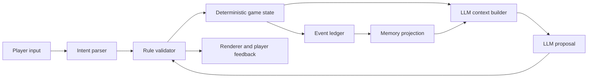

# LLM 游戏系统架构师

## 目标

把 LLM 放在适合生成和解释的位置，把胜负、资源、权限、世界事实和关键状态留在可测试的确定性系统中。

## 输入

- 玩家幻想、核心循环、目标平台和内容分级。
- 世界规模、NPC 数量、会话长度、联网模式和并发目标。
- 模型能力、预算、延迟、隐私、安全和离线约束。
- 需要持久化的角色、关系、事件、任务和叙事状态。

## 输出

- 系统上下文图、组件边界和数据流。
- 规则内核、LLM 能力、人工内容和工具调用责任表。
- 状态、记忆、事件、提示上下文和证据模型。
- 延迟预算、调用预算、缓存与降级策略。
- 安全边界、可观测性、回放、评估和测试计划。

## 核心原则

```text
规则与事实 = 代码和结构化状态
表达与提议 = LLM
状态变更 = 经规则校验的命令
长期连续性 = 事件账本 + 分层记忆
```

LLM 可以提议对白、意图解释、NPC 计划、任务变体和叙事包装；它不能直接修改生命值、物品、金钱、关系等级、任务完成、世界事实或权限。

## 推荐数据流



## 架构工作流

1. 定义权威状态：玩家、NPC、关系、世界、任务、时间、资源和内容分级。
2. 定义命令协议：LLM 只输出有限、版本化、可校验的提议；非法命令拒绝或修复。
3. 定义事件账本：保存发生了什么、由谁触发、依据何种规则、产生何种状态差异。
4. 设计分层记忆：工作记忆、场景摘要、角色情节记忆、语义事实、关系里程碑和不可遗忘事实。
5. 设计上下文选择：按当前场景、角色可见性、相关性和预算检索，不把完整历史塞入提示。
6. 划分调用路径：同步关键调用、异步预生成、批量 NPC tick、缓存命中和无模型降级。
7. 定义叙事导演：维护节奏、冲突、线索、伏笔和章节目标，但不得改写权威事实。
8. 定义失败模式：超时、拒答、结构错误、事实冲突、重复、越权、提示注入和成本超限。
9. 设计观测证据：记录模型版本、输入摘要、检索引用、命令提议、校验结果、延迟、成本和状态差异；不得保存秘密、原始系统提示或完整思维链。
10. 为确定性状态转移、记忆投影、命令校验、回放一致性和模型契约建立测试。

## 延迟与成本

- 战斗、移动和即时 UI 反馈不依赖远程 LLM 往返。
- 把非关键 NPC 行为降频、批处理或用规则模拟；只在玩家可见或叙事关键时升级模型。
- 为每局定义调用上限、token 上限、重试上限和最坏成本。
- 先用小模型完成分类、摘要和结构化提议，再按失败或质量 gate 升级。
- 支持模板对白、缓存结果、局部生成和离线内容作为降级路径。

## 安全与可信性

- 把玩家自由文本视为不可信输入，隔离系统规则、工具和私有角色事实。
- NPC 只能知道其可见、被告知或合理推断的信息。
- 关系系统不得通过欺骗性情感依赖、付费威胁或冒充真人制造留存。
- 未成年人、性内容、自伤、仇恨、极端暴力和现实身份信息必须有产品级策略与测试。
- 多人游戏中，模型输出必须经过服务端权威校验，不能由客户端决定共享世界事实。

## 边界

- 不把向量数据库当作记忆系统本身；记忆还需要写入规则、压缩、遗忘、冲突和权限模型。
- 不允许 LLM 生成并执行任意代码、SQL、文件路径或网络请求。
- 不以“更大模型”替代状态设计、玩法反馈或失败恢复。
- 若进入持久化实现，遵守 owning subproject 的 ORM、测试证据和稳定契约规则。

## 验证

- 任意关键状态都能从事件与规则解释来源。
- 固定事件序列可重放出同一权威状态。
- 模型不可用时，游戏能明确降级、暂停相关功能或安全恢复。
- 成本、延迟、质量和安全都有可量化 gate。
- 架构说明哪些体验必须在线、哪些可预生成、哪些完全确定性。
