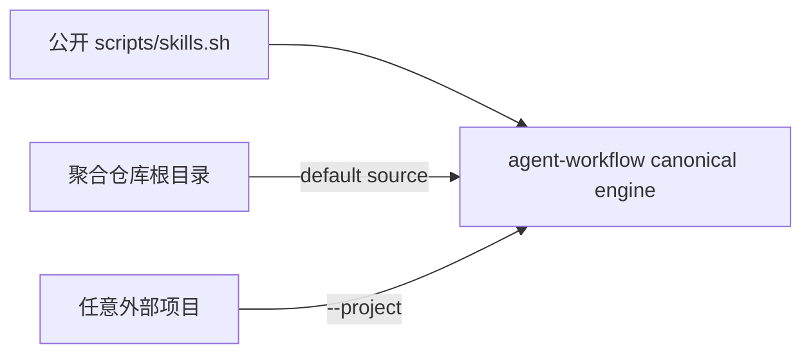

## Context

canonical 引擎位于独立 `agent-workflow-skills` owner。聚合仓库已通过 Git submodule 挂载该 owner，因此只需提供稳定的路径适配和 source 默认值。

## Goals / Non-Goals

**Goals:**

- 用户克隆聚合仓库后可直接运行 `scripts/skills.sh`。
- adapter 自动把聚合仓库根目录作为默认 source。
- 所有其余参数和退出码透传给 canonical 引擎。

**Non-Goals:**

- 不复制管理实现。
- 不在 adapter 中维护 profile、路由或同步逻辑。
- 不替代 `npx skills add` 的单 Skill 安装场景。

## Decisions

### 1. 薄 adapter

adapter 只定位 submodule 内 canonical engine，并通过真实参数调用。submodule 未初始化时给出明确修复命令。

## Risks / Trade-offs

- [submodule 未初始化] → adapter 明确提示运行 `git submodule update --init --recursive agent-workflow`。
- [canonical engine 路径变化] → 路径属于 adapter contract，变更时必须同步 validator 和迁移说明。

## Migration Plan

新增入口，无既有消费者迁移。回滚时删除 adapter，用户仍可使用 `npx skills add` 或直接调用管理 Skill 内脚本。
