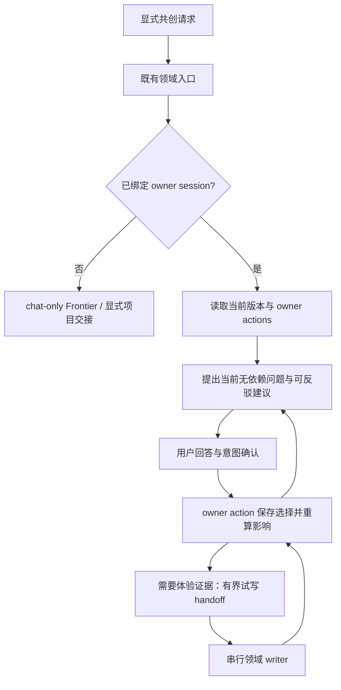

## Context

现有 `creative-grill-me` 聚合入口、`novel-grill-me`、`manga-drama-grill-me` 和 `creative-grilling` 共享协议均保留。其他 AI 做剧已有 `ai_drama` 分支及 decision map；复用这条路径即可满足专用问法，不另造竞争入口。

当前 v0.1 route/brief/handoff 是聊天与便携交接合同。本次给它增加可选 owner-session 适配，不让 Skill 变成数据库或运行器。产品 consumer 的工程实现不属于本源。

## Goals / Non-Goals

**Goals:** 深度逐轮共创、从想法到成稿的阶段分支、owner 状态恢复、实际写作往返、项目内反馈的可解释引用，以及宿主无关验证。

**Non-Goals:** 编写正文、接受 Canon、模型调用/训练、跨作品偏好实现、自动创作实现、安装或批量启用 Skills、修改独立源子模块。

## Decisions

### 1. 复用现有入口与最小加载

领域明确时直接进入对应分支。小说使用现有 novel frontiers；漫剧使用 manga-drama frontiers；其他做剧扩展现有 `ai-drama-decision-map.md`，覆盖短剧、电视剧、电影、单元剧、喜剧与音频剧的 stage/artifact 差异。未声明媒介不推断平台；只在差异会改变当前问题时询问。

每轮一个主要访谈流程，最多一个兼容领域约束。进入 writer 时暂停访谈 primary，串行交给既有 router 选择的最窄 writer；候选返回后恢复会话。不因此创建子 Agent。

### 2. Owner-session 可选扩展

新增实验性 `creative.owner-session-binding.v0.1`，只携带 owner capability ref、project/session ref、session revision/digest、source refs、workflow version 和 owner action descriptors。它是 v0.1 route/brief 的可选 companion，不向旧 strict schema 强塞字段。

动作描述使用 typed action ID、输入 schema ref、预期版本与权限说明；本源不接受任意 shell 命令模板作为可执行指令。宿主 adapter 将已发现的 owner action 映射到本地真实 CLI/API，缺失时 `needs_contract`。不能从文档猜新命令已安装。

### 3. 提问和恢复

- Skill 负责提出阶段决策节点和语义依赖；owner 负责验证依赖无环、来源当前、状态与权限合法。
- 无当前 revision 时先刷新；不能拿旧 Q1/Q2 序号提交到新一轮。跨宿主恢复展示决定摘要、未决项和重开原因，不要求重答仍有效问题。
- 深度模式允许用户逐步讨论人物动机、热点和替代策略；不强制固定问题数，不预写依赖尚未确定的完整问卷。
- “不知道”“哪个更好看”进入有界 research/proof 路径。用户确认该阶段共识并授权试写后交 writer；需要证据的假设可保持开放，不以继续追问伪造答案。
- 宿主有结构化提问控件时使用控件；没有时用编号文本。不能因为缺少特定 Plan 模式拒绝工作。

### 4. 作者权力与反馈

用户回答是决定来源；Agent 建议和推断始终保持 proposal/hypothesis。方向可挑战关键剧情，但高影响选择必须保留用户理由、影响范围和后续义务。当前已授权动作不重复确认，理解确认不能扩展为写入/发布/自动采纳授权。

owner 返回的已确认项目反馈可以作为引用依据；Skill 必须允许作者推翻旧偏好，不把一条反馈普遍化到其他作品。未来个人偏好、多作者参考与自动候选创作分别记录在路线中，当前没有对应 capability 就不调用、不模拟。

### 5. 所有权与验证

允许修改的实现路径仅为 `creative-writing-core/` 下五个既有入口/协议的正文、references、元数据生成输入和现有 validator。Auctra 命令示例由 consumer 的文档负责，本源用 portable capability/action 说明。`auctra-novel/` 和 `ai-drama/` 不在租约中；现有 nested adapter 维持 legacy 行为。

复用 `creative-grilling/scripts/validate_creative_grilling_matrix.py` 扩展静态矩阵；不用静态用词命中宣称访谈质量。另使用作者确认的合成 transcript canary，检查同轮依赖、重开、恢复、拒绝全部、未知转试写、真实写作往返、授权与降级。Auctra 不可用时 portable fake owner 足以验证本源。

## Risks / Trade-offs

- 专业问法变成模板 → 用人物压力、不同代价和后果的反例测试，允许推荐维持现状。
- 恢复时忠于旧聊天而非新稿 → source/session 版本由 owner 提供，stale 后先刷新。
- owner action 被误当任意命令执行 → 固定 typed capability 适配，不解释不可信 shell 字符串。
- 静态矩阵通过但交互差 → 保留 transcript canary 与真实产品试验的不同证明范围。

## Migration Plan

保留既有 Skill 名称、references 路径与 v0.1 三类输出；新绑定可选。旧 owner、无项目或无 capability 时继续原 chat-only/brief handoff，明确没有持久恢复。源修改通过宿主 profile 的既有管理命令同步，不直接编辑 `.agents`/`.claude`。回滚只关闭新 binding，历史 owner 状态不删除。

## Open Questions

无阻塞实施的产品问题。具体题材、人物和作品内容在使用时由作者决定；宿主工具名字通过能力发现解析，不在本源写死。
